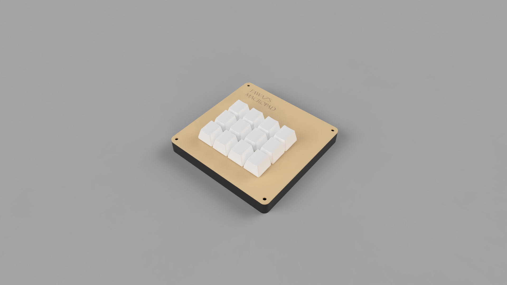
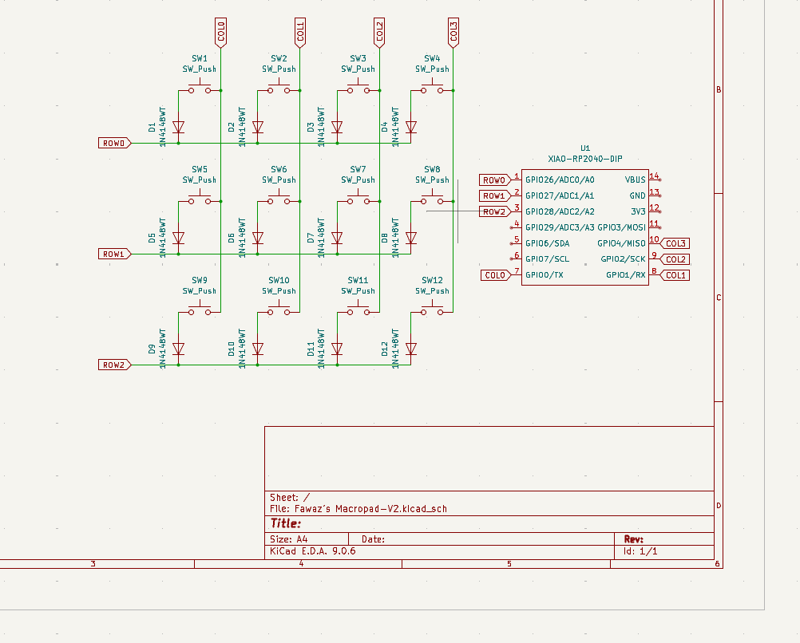
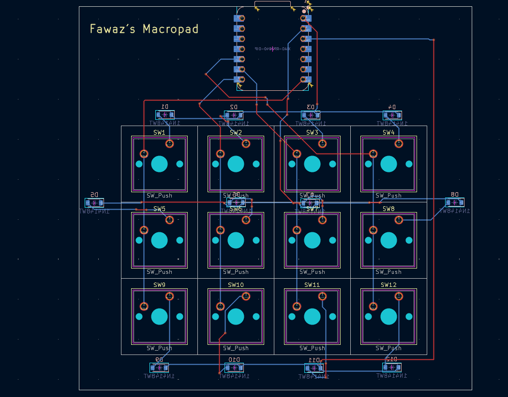

# Fawaz's Macropad

A custom 12-key macropad designed to increase productivity while programming or designing, built with the Seeed Xiao RP2040. This project was designed in KiCad (PCB) and Fusion 360 (Case).

|           Schematic            |           PCB           |                   Case                    |
| :----------------------------: | :---------------------: | :---------------------------------------: |
|  |  |  |

## Bill of Materials (BOM)

- 1x Seeed Xiao RP2040
- 12x MX-Style Switches
- 12x White DSA Keycaps
- 12x 1N4148 Diodes (SOD-123 Surface Mount Diodes)
- 3D Printed Case
- 4x M3x16 Bolt

## PCB Design

The PCB uses a standard matrix layout with surface-mount diodes.

## Case Design

The case is a two-part snap-fit design with a dedicated cutout for the USB-C port.

## Firmware

This macropad runs on [KMK Firmware](https://github.com/KMKfw/kmk_firmware) firmware.
